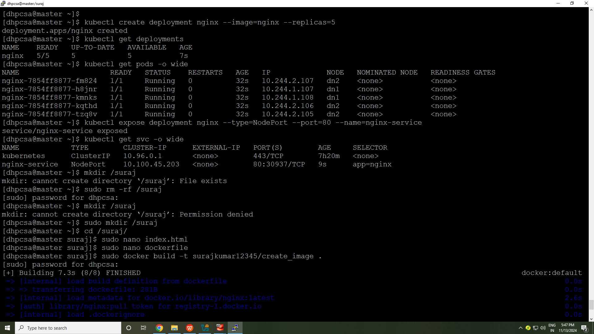
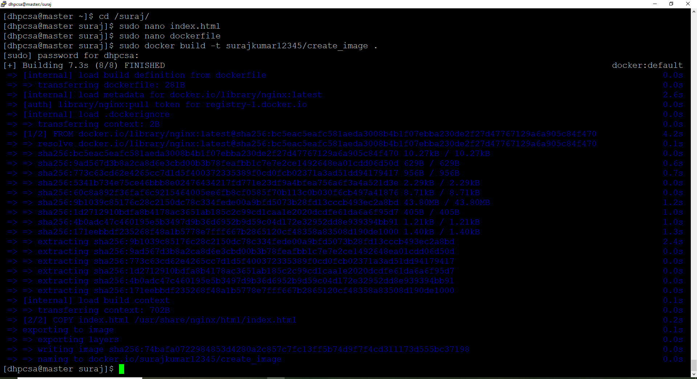
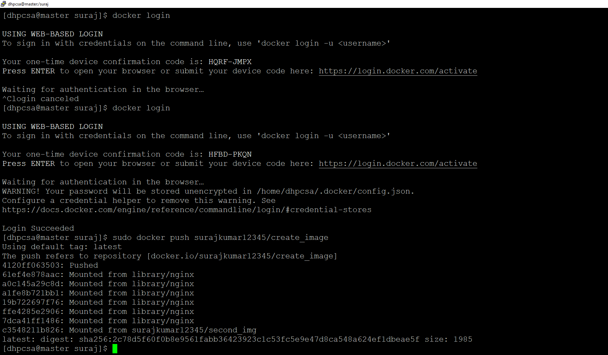
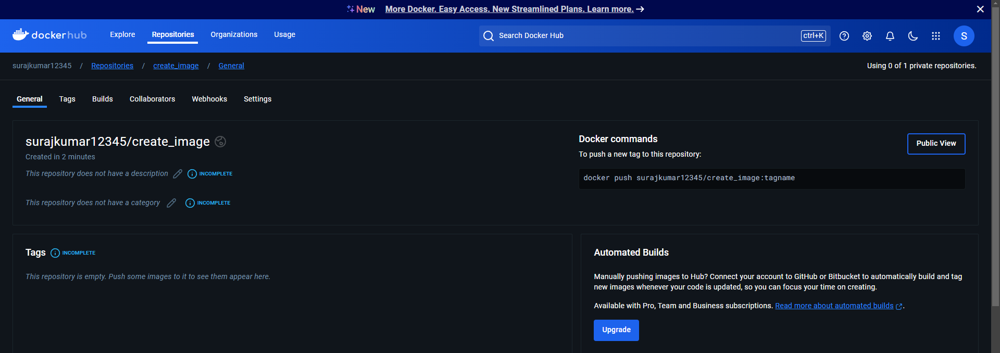
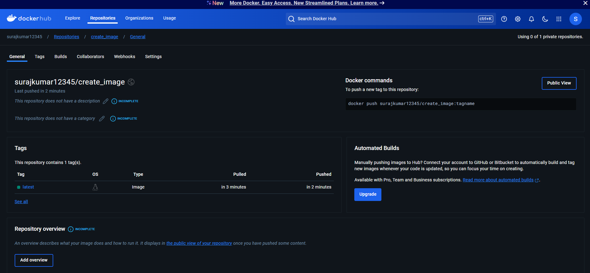

# Deploying and Exposing an Application in Kubernetes and Pushing own image to DockerHub.

*This implementation provided hands-on experience with essential DevOps tools and workflows by guiding me through deploying an Nginx server on Kubernetes, customizing its content, and creating a Docker image that I then pushed to Docker Hub. Through these steps, I learned how to manage Kubernetes deployments, build custom Docker images, and distribute them for broader use.*

<br>


## Follow below steps to implement.
<br>

### Step 1: Create Deployment Using Nginx Image

Start by creating a deployment using the official Nginx image from Docker Hub:

```bash
kubectl create deployment nginx --image=nginx
```

*This creates a deployment named nginx with the Nginx image.*


- Verify the deployment with:

```yml
kubectl get deployments
```

- To see the created pods:

```yml
kubectl get pods
```


### Step 2: Expose the Deployment (Optional)
- You can expose the deployment as a NodePort service to access it externally:

```yml
kubectl expose deployment nginx --type=NodePort --port=80 --name=nginx-service
```

*This creates a service named nginx-service on port 80.*

- To find the NodePort for external access, run:


```yml
kubectl get svc nginx-service

```


### Step 3: Create a Custom Docker Image
1. Create a directory for the project:

```yml
mkdir custom-nginx && cd custom-nginx
```
2. Create a custom index.html file:

```yml
echo "<html><body><h1>Hello from my custom nginx image!</h1></body></html>" > index.html
```
3. Create a Dockerfile in the same directory:

```yml
touch Dockerfile
```
4. Edit the Dockerfile to use the custom HTML file:

*Dockerfile content*

```yml
# Use the official nginx image as a base
FROM nginx:latest

# Copy the custom HTML file to the nginx server
COPY index.html /usr/share/nginx/html/index.html

# Expose port 80
EXPOSE 80

```


### Step 4: Build the Custom Image Locally
- Build the Docker image with a custom tag:
- Also first make a repository in your DockerHub.
- Copy that repository name with username and paste below.
  
  *(we have to push the image in this format only  <b>your_dockerhub_username / RepoName </b> in the DockerHup ,so build image in this format only,otherwise we have to change the name using tag at the time of push image)*

```yml
docker build -t your_dockerhub_username/custom-nginx:latest  .
```
  - *Replace your_dockerhub_username with your Docker Hub username.*
  - *The -t flag tags the image with a name and version.*
    
### Step 5: Log in to Docker Hub
- Log in to your Docker Hub account:

```yml

docker login

```
- *Verify the credentials*
- *Enter your Docker Hub username and password.*


### Step 6: Push the Custom Image to Docker Hub
- Push the custom image to Docker Hub:

```yml
docker push your_dockerhub_username/custom-nginx:latest

```

*Replace your_dockerhub_username with your Docker Hub username.*

### Step 7: Verify the Image on Docker Hub

*Log in to Docker Hub and confirm that your image (your_dockerhub_username/custom-nginx) is available under your repositories.*


<br>
<br>

*This process reinforced key concepts like container orchestration, image customization, and version control, equipping me with practical skills for managing and deploying containerized applications in real-world environments.*


<br>
<br>
<br>


## ------------------Screnshots--------------------
1.
<br>
<br>




2.
<br>
<br>





3.
<br>
<br>




<br>
<br>


4.
<br>
<br>




<br>
<br>

5.
<br>
<br>

## -------We pushed our image to the DockerHub-------------



<br>
<br>

